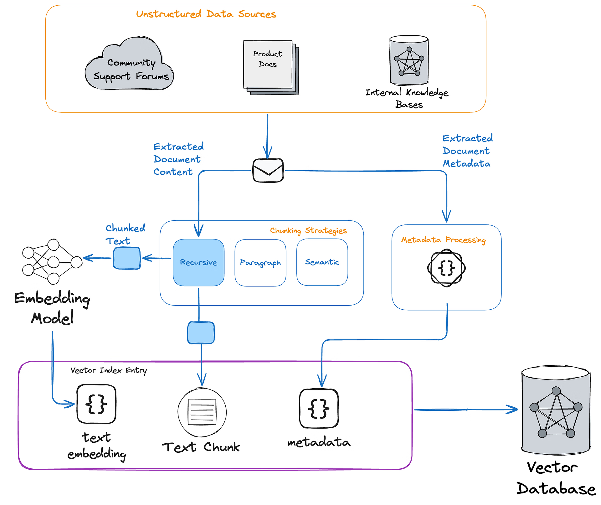

# ClickUp RAG AI Project Manager Agent Demo

## Overview

This project is an AI-powered intake triage system that integrates with ClickUp to automatically process incoming tasks and add context-aware comments.

It uses a Retrieval-Augmented Generation (RAG) pipeline to analyze tasks against internal documentation and generate structured recommendations such as:

- Category (Bug, Feature, etc.)
- Priority (P0–P3)
- Owner (Frontend, Backend, etc.)
- Next Action

The system then writes results back to ClickUp by:

- Posting a comment with the AI-generated triage
- Automatically updating the task status

## Demo Workflow

- A new task is created in ClickUp under **New Intake**
- The backend service polls ClickUp every 30 seconds
- The system:
Extracts task title + description
Retrieves relevant internal docs using vector search
Generates a triage recommendation using an LLM

- The system:
Posts a structured comment to the task
Moves the task to **Processing**

## Architecture

## Components

#### ClickUp API Client
- Fetch tasks
- Post comments
- Update task status

#### Poller
- Runs every 30 seconds
- Detects new intake tasks
- Prevents duplicate processing via SQLite

#### RAG Pipeline
- Loads markdown documents (/kb)
- Splits into chunks
- Stores embeddings in Chroma (vector DB)
- Retrieves relevant context per task

#### LLM Layer
- Generates structured triage recommendations

#### Persistence
- SQLite database tracks processed tasks

## Knowledge Base (RAG)

The system uses internal documentation to guide decision-making:

- Engineering Intake SOP
- Bug Triage Playbook
- Task Prioritization Policy

These documents simulate real-world company processes and allow the AI to make context-aware decisions.

## Summary

This demo presented how Agents can:

- Automate operational workflows
- Improve triage consistency
- Reduce manual overhead for engineering teams

